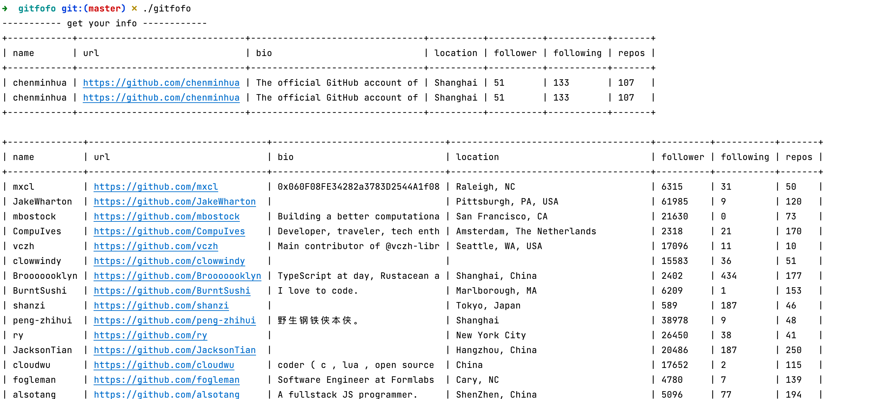
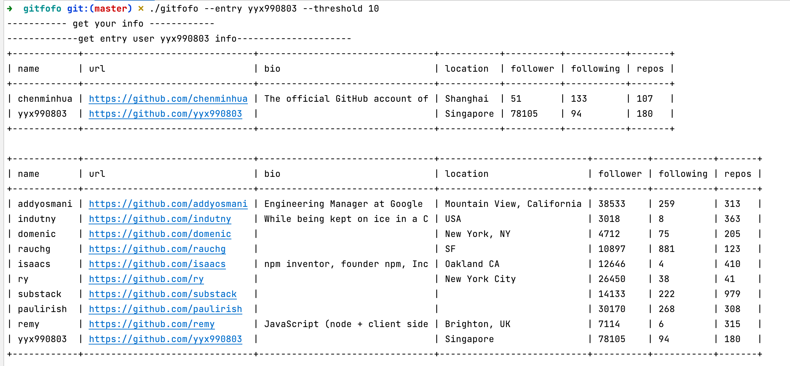

## why gitfofo

gitfofo is a cmdline tool utilized github api which can help you to explore your tech boundaries, find more interest people in github.

The idea is very basic, if several of the person I'm following follow some guy I don't know, I might be interested. 

This program will start from you(or other github user as entry person), find your following, and then collect your following's following.
Then output the person with most sharedFollowers.

## usage

```
./gitfofo -h
Usage of ./gitfofo:
  -entry string
        gitfofo entry user, default is *you*
  -threshold int
        threshold of shared follower count (default 5)
  -token string
        github personal access token
```

- entry is the entry point user. if omitted, gitfofo will start from you.
- threshold default 5, you can set it higher if you want less output(and person more likely you will be interested in)
- token is your github personal token。if you don't want to pass it everytime, you can set it as an environment variable.

```
export git_token=xxxxxxx
```

[how to get github personal access token](https://docs.github.com/en/authentication/keeping-your-account-and-data-secure/creating-a-personal-access-token)

## 为啥要搞gitfofo

利用github api，帮你找到感兴趣的人。

原理很简单，如果我关注的人中，有几个人共同关注了一个我不认识的人呢，那我很可能也会对这个人感兴趣。

这个程序会从你（或者其他github用户）出发，找到你的关注，以及你的关注的关注。
然后过滤掉你已经关注的人，将剩下的人中，被你关注的人关注的最多的用户输出。

## screenshots




## 用法

```
./gitfofo -h
Usage of ./gitfofo:
  -entry string
        gitfofo entry user, default is *you*
  -threshold int
        threshold of shared follower count (default 5)
  -token string
        github personal access token
```

- entry表示的是这次查询的起始用户，如果不填的话默认就是从你开始（输出你关注的人更爱关注的人）
- threshold是一个阈值，约高表示只有当用户被你关注的人关注的越多才能被输出（越严格，输出数量也就越少）
- token是github personal token。如果你不想在每次请求时传递，也可以把他加到你的环境变量中。